

<h1>TikTokPlugin</h1>

<i>Seamlessly connect Unreal Engine to any TikTok Live</i>

---

# Table of Contents
- [1. Intro & Setup](#1-intro--setup)
  - [Installation](#installation)
  - [In-Editor Setup](#minimal-in-editor-setup)
- [2. TikTok Event Handler](#2-tiktok-event-handler)
  - [Available Events (Binding)](#available-events-binding)
- [3. TikTok User Registry](#3-tiktok-user-registry)
  - [Auto Cache Profile Pictures](#auto-cache-profile-pictures)
  - [User Functions](#user-functions)
  - [Teams](#teams)
  - [Leaderboards](#leaderboards)
- [4. TikTok Gift Queues](#4-tiktok-gift-queues)
  - [Gift Queue Manager Functions](#gift-queue-manager-functions)
  - [Gift Queue Bindings](#gift-queue-bindings)
  - [Gift Queue Functions](#gift-queue-functions)
  - [Gift Queue Examples](#gift-queue-examples)
- [5. Closing](#5-closing)

---

# 1. Intro & Setup

 
**TikTokPlugin** is a plugin inspired by [TikTokLive](https://github.com/isaackogan/TikTokLive) and powered by [EulerStream](https://www.eulerstream.com/) cloud websockets. The plugin enables seamless integration of TikTok livestream interactions into Unreal Engine with the click of a button. This is achieved through the creation of C++ classes that utilize Eulerstream websockets to fire off Unreal Engine Events. With **TikTokPlugin**, you can connect to any TikTok livestream and use viewer interactions—such as comments, likes, and gifts to trigger real-time in-game events. This plugin is designed to elevate live-streamed gaming experiences by leveraging TikTok's vibrant interactivity.

### Features

- Event-driven architecture for TikTok Live (Joins, Likes, Comments, Shares/Follows, Gifts, RoomInfo, and more!)
- User Registry (avatars, user data, teams, leaderboards)
- Gift Queues (by tag or value buckets)

### Installation

1. Clone or download the repository.
2. Copy the plugin folder for **your engine version** into your project’s `Plugins` directory.  
   
3. Enable the plugin in the Unreal Editor (should be automatic).  
   
4. Start the project.

### Minimal In-Editor Setup

1. Create a `GameInstance` Blueprint and set it in **Project Settings → Maps & Modes**.  

   
2. OPTIONAL: In `GameInstance`, wire **Event Shutdown** → **Close TikTok Connection** to clean up processes after connection ends.  
   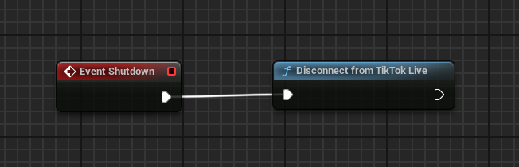

   -    I say this is optional because you can decide where you place this node and how you want to disconnect. For example, the test blueprint below already has `Disconnect from TikTok Live` placed after `EndPlay`. It doesn't really matter where you place this, so long as the connection is closed when you are done.
3. Built into this plugin is a test blueprint. Access this by first going to your content browser `CTRL + Space` and clicking settings in the top right corner. Check `Show Plugin Content`.

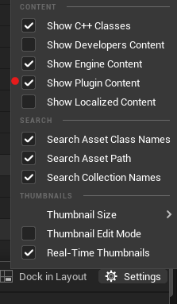

-   You will now be able to see the sample blueprints under `Plugins/TikTokPlugin Content`.
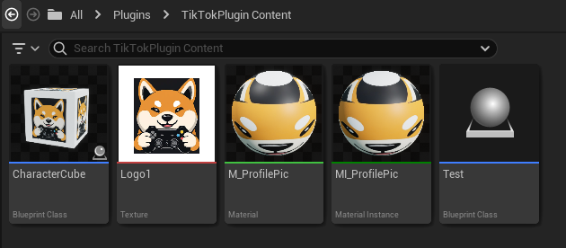

4. **DRAG [TEST] BLUEPRINT INTO THE LEVEL** 
-   On `BeginPlay`, call **Connect To TikTok Live** with a handle.  **IMPORTANT**:  The plugin utilizes the Eulerstream websockets service.  In the image below, you can see that to [Connect to TikTok Live] you need to enter your API key.  You can get a `FREE`  API key for Eulerstream by going to https://www.eulerstream.com/pricing .  This free key can utilize up to 5 concurrent WebSocket connections. If you end up shipping a game to a large base, you may need to upgrade this key -- but for development purposes the 5 connections is more than enough.
   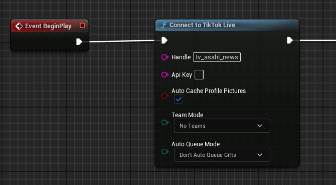
5. On success, the **Get TikTok Event Handler** node is called in order to bind events. This test blueprint will bind to the `OnLike` Event and spawn a cube with the user's profile picture every time they like the livestream. 
   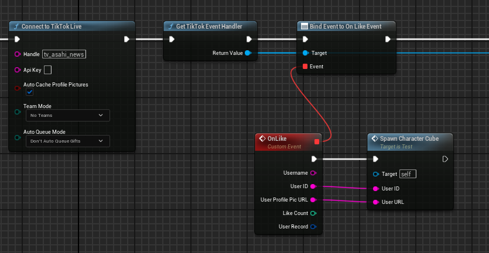

   

---

# 2. TikTok Event Handler

This tiktok event handler is what is used to bind functions to TikTok events. Simply drag off the blueprint node and then type "TikTok" to see all options -- bind a custom function to any of the TikTok events included in this plugin. 
-   Example: If you bind a function to the OnLike event, every time someone likes the stream the OnLike event will fire your function and corresponding game logic.

## Available Events (Binding)

- **OnJoin** — `Username, UserID, UserProfilePicURL, UserRecord` -- This node fires off every time a new user joins the Livestream. It is especially useful if you have `Auto Cache Profile Pictures` turned on. If so, the user's profile picture is cached as soon as they join the livestream. The users data is also added to the User Registry when they join by default.

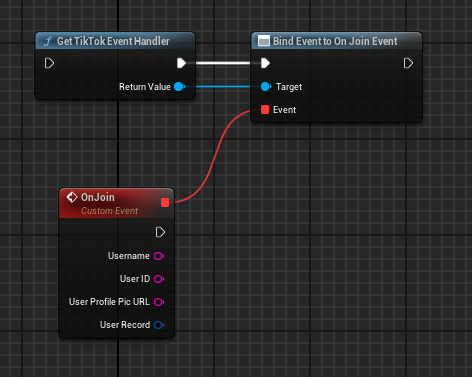

- **OnComment** — `Username, UserID, UserProfilePicURL, CommentText, UserRecord` -- This node fires off every time a user comments. You can use this to call functions or game logic for specific  key words or comments. In team mode, the comments are handled internally to assign teams based on user comments, you can change the string keys for joining each team by `Get TikTok User Registry --> Set Join Team Strings`.

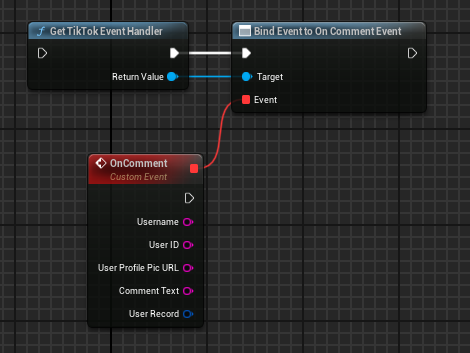

- **OnLike** — `Username, UserID, UserProfilePicURL, LikeCount, UserRecord` -- This node fires off every time a user likes/taps the screen. This is useful if you want to spawn actors for users that like the stream. You can also implement meters in your game that fill up after [n] likes. All likes are stored in a users record automatically; simply drag off `User Record` and break the struct to access.

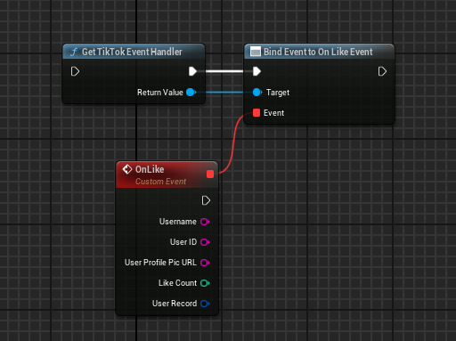

- **OnGift** — `Username, UserID, UserProfilePicURL, GiftType, GiftValue, UserRecord, Gift` -- This node fires off every time a user sends a gift to the livestream. During `Connect to TikTok Live` you will select Team Mode and Auto Queue Mode. There are many combinations. 
    - If you select `[No Teams] and [Don't Auto Queue Gifts]`, then nothing will really happen. You can still manually create gift queues.
    - If you select `[No Teams] and [Auto Queue Gifts by Tag]`, then gifts will be assigned the global team and be sorted into their unique queues based on the gift name or tag.
    - If you select `[Four Teams 1-4] and [Auto Queue Gifts by value]`, then users will be sorted into teams whenever they comment the string key. If they don't join a team, their gift will be in the global team queue. If they join a team, their gift will store this team, and the gift will be sorted into that teams unique queue. [Auto Queue Gifts by Value] simply means that there will be predetermined diamond/coin ranges for queues. If [Auto Queue Gifts by tag] was selected, then the gifts would be sorted into each teams unique queue based on the gift name or Tag. No matter what modes you select, you can still manually add gifts to queues and process them however you want.
    - A gift struct with all user/gift data will be output as well with the User Record whenever the OnGift event fires.

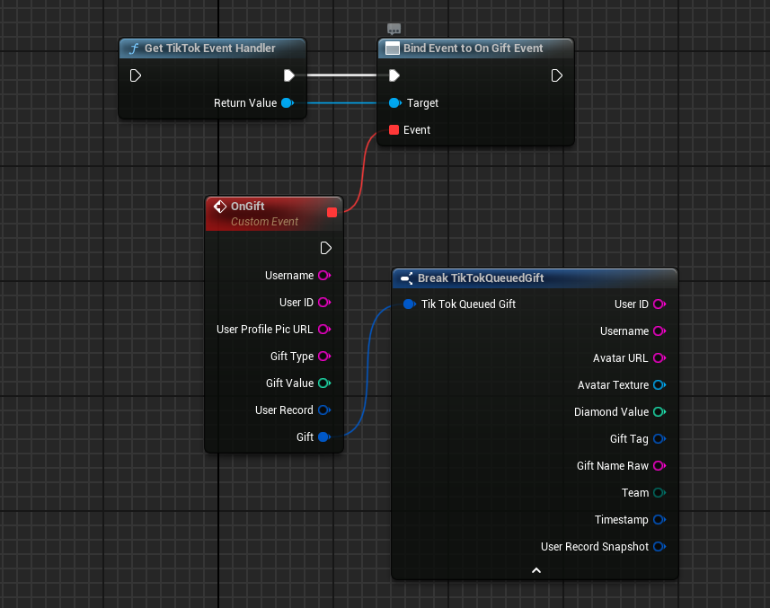

- **OnShare** — `Username, UserID, UserProfilePicURL, Shares, UserRecord` -- This node fires off every time a user shares the livestream. The total times a user has shared will be stored in their User Record. You can use this value to limit anyone that is spamming "copy link" to engage. 

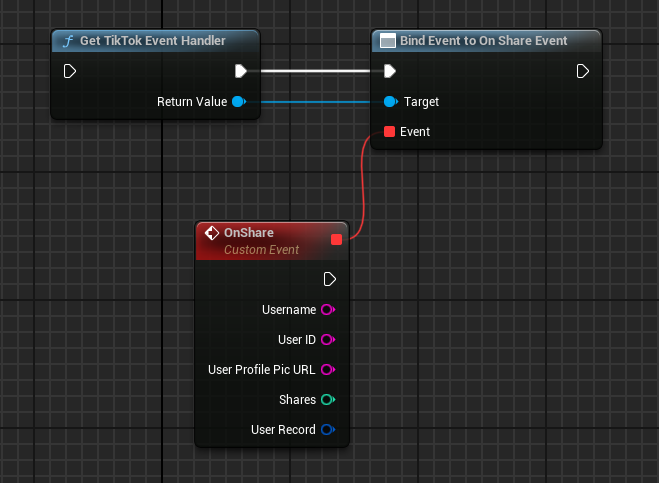

- **OnFollow** — `Username, UserID, UserProfilePicURL, AlreadyFollowed, UserRecord` -- This node fires off whenever a user first follows the livestream. Whenever someone follows, it is stored in their User Record that they have already followed during the current stream. The bool `Already Followed` allows for a branch to filter anyone trying to unfollow --> refollow to spam engagement. 

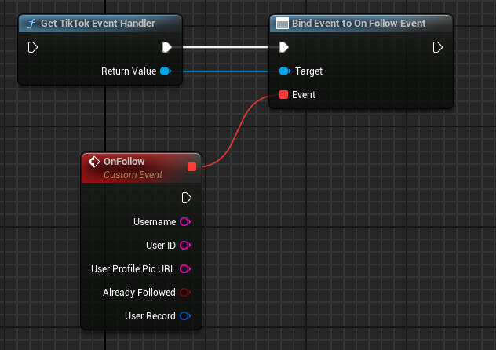

- **OnRoomInfo** — `RoomTitle, ViewerCount` -- This node fires off regularly with the current viewer count and the room title. This node can be useful to continuously update your game with the number of viewers. Maybe you want some gifts to be weighted more when there are <10 viewers as apposed to when there are over 300 viewers. The `ViewerCount` can be utilized as a weight to handle different game logic.

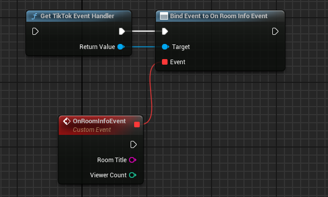

- **OnDisconnected** — `Reason` -- In the event of an unexpected disconnect, this node will fire off. You can use this to debug, or to pause certain functions while disconnected.

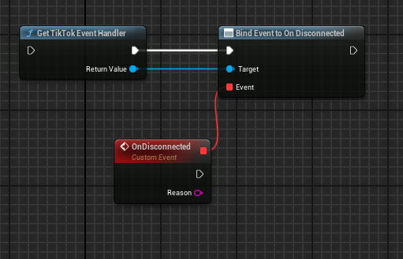

- **OnReconnected** — `()` -- This node will fire off when reconnected. You can use this to debug, or to unpause certain functions that were previously paused while disconnected. 

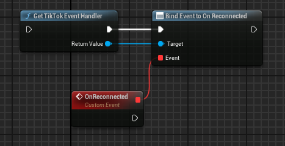

---

# 3. TikTok User Registry

## Overview
UTikTokUserRegistry is a singleton that lives for the life of the process. It tracks every viewer/user that joins or interacts in any way with the TikTok livestream that you are connected to. The registry is responsible for keeping user records up-to-date, managing auto-caching of user profile pictures, managing global leaderboards, and managing teams as well as team leaderboards. 

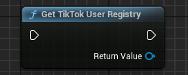

---
## Auto Cache Profile Pictures
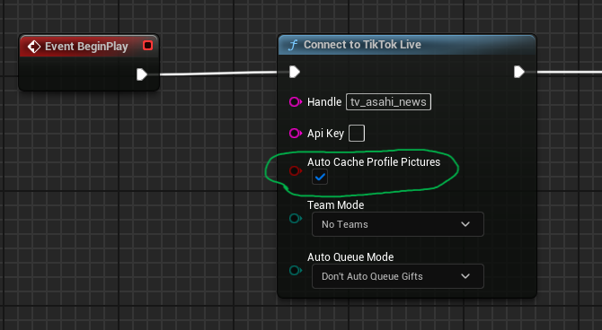

-   While this is selected, the registry will automatically download the profile picture of anyone that joins or interacts with the livestream in any way. This is very useful, so that you don't need to constantly redownload profile pictures during gameplay. This process does not leak any memory and is pretty lightweight. Most profile picture textures are only 10s of kilobytes and download almost instantly -- The registry could hold thousands of profile textures and still only take up under 100mb of memory. 
-   Once downloaded, the profile picture texture is stored in the user's personal record and can be accessed during gameplay instantly. This can be done by accessing the UserRecord struct, or by using the `Get User Profile Texture` blueprint node. Both of these require the specific userID to access.

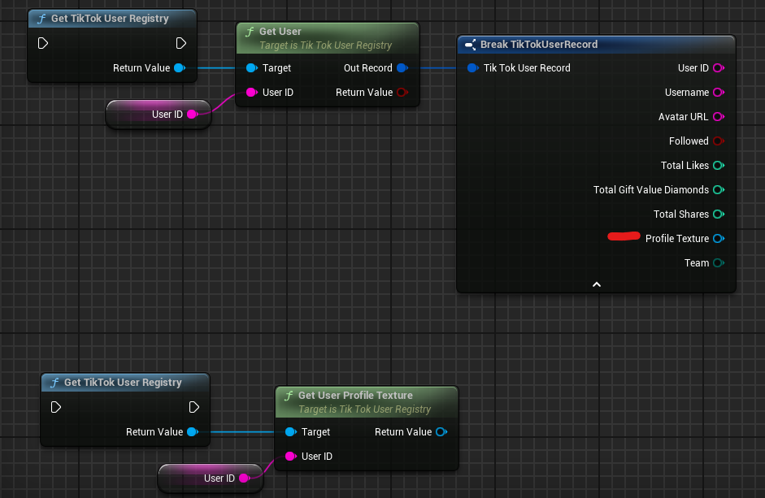

### Auto Cache Profile Pictures: `Disabled`
-   If auto cache is disabled, you can still manually store profile textures inside a User Record. In this case, drag off of any event (like, comment, gift, etc) and use that user's URL and UserID to manually store the texture inside the registry using Unreal's built in `Download Image`. See below. 

`Event --> Get Registry --> Download Image --> Set User Profile Texture`

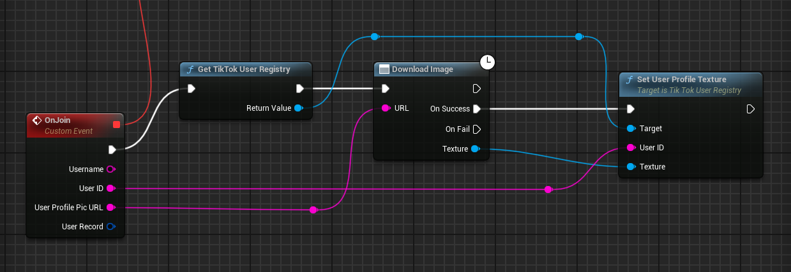
-   After being manually stored in the registry, this image texture will now be accessible the same as if it was Auto-Cached. Simply access a User's Record to use the texture. 

### Get and Set Auto Cache
-   During runtime, you can use `Get Auto Cache Avatars` and `Set Auto Cache Avatars` to manage and change the state of auto-cache whenever you want. If auto-cache has been disabled for a long time, if enabled, all users in the registry will have their profile textures downloaded in the background (not all at once) and then stored in the User Registry.
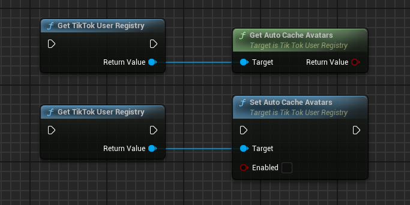
---
## User Functions
There are many registry functions that can get current settings for states like auto-cache, get lists of users, and access or mutate the data inside a User's Record. 

-   `Get All Users` -- This blueprint node will return a map of all Users in the registry. This is useful if you want to access the entire array of user records inside the registry (**See image**). You can also do other things like get the size of the user registry.
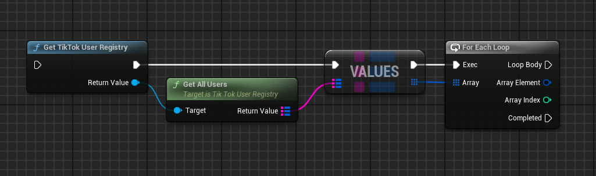

-   `Get User` -- Similar to the previous node, but this time, just a single lonely user. Input a string UserID and instantly access a User Record. This is useful to check how many likes a user has sent, how many total diamonds, how many total shares. Also, to check what Team a user is on. (right click "out record" and split the struct pin to see all user data)
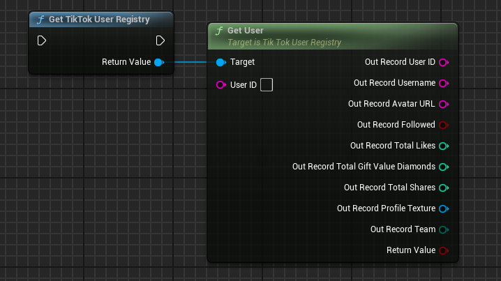

-   `Get User Profile Texture` -- Simply input a UserID and instantly get a reference to that user's stored profile picture texture. This texture will be **null** if you have auto-cache turned off and have not manually stored the texture into the User Record. This blueprint node is especially useful when updating widgets and material instances in real time. In the sample blueprint, we spawn a cube with the user's profile picture every time they like the livestream. This is done with the [Get User Profile Texture] node. 
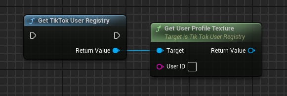

-   `Reset User Gift Diamonds` and `Set User Gift Diamonds` -- Use **Reset** to reset a Users total diamonds to zero. This will update their User Record. Use **Set** if you want to change a User Record and store a new total diamond value for that user. Maybe a user comments a naughty work --> `bind to OnComment --> Filter by string --> Reset User Diamonds`. Or something like that. Idk, you could use this for something I'm sure.
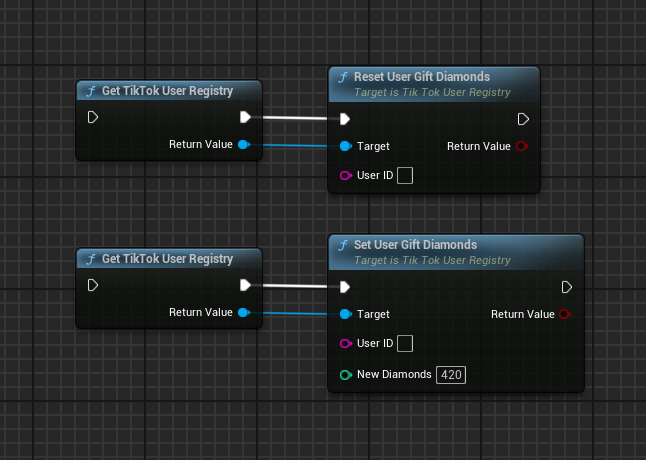

-   `Reset User Likes` and `Set User Likes` -- This is just like the [**Set/Reset User Gift Diamonds**] but now for Likes. This could probably be useful. Maybe periodically poll all users total likes, then if they have 10000 likes: Reset Likes --> Spawn Something Cool For That User --> User is happy. The User's registry will go back to 0, but all other users still have varying like totals in their own Records. This could open up some cool gameplay loops where things spawn every [n] likes for each user. 
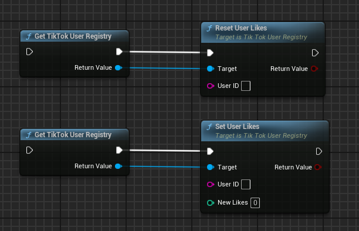

-   `Reset User Stats` -- This is basically just an all-in-one function that allows you to select what stats to reset for a user; Likes, Gifts, Shares.
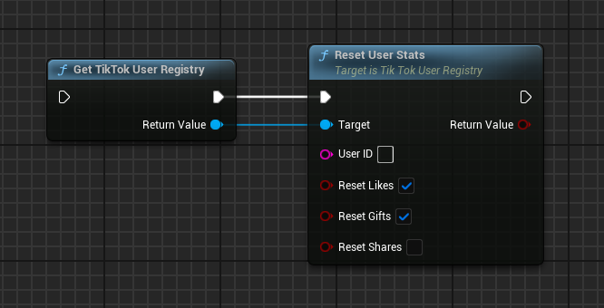

---
## Teams

-   Team mode is first selected on `Connect to TikTok Live`. There are essentially 5 teams (None, Team 1-4). You can use this to create team games and have viewers compete with each other.
    -   If Team Mode == No Teams, then all user data will be stored with "None" as their team. If Auto Queue Mode is active for gifts, all gifts will automatically queue into the "No Team" queue. 
    -   Alternatively, if Team Mode == Four Teams (1-4), then users will be required to comment a certain string in order to join a specific team. If they don't comment the proper string, they will remain in team "None". The default strings are "1", "2", "3", "4" - but these can be set to whatever strings you want. Once in a team, user data and all gifts will be stored for that team. 
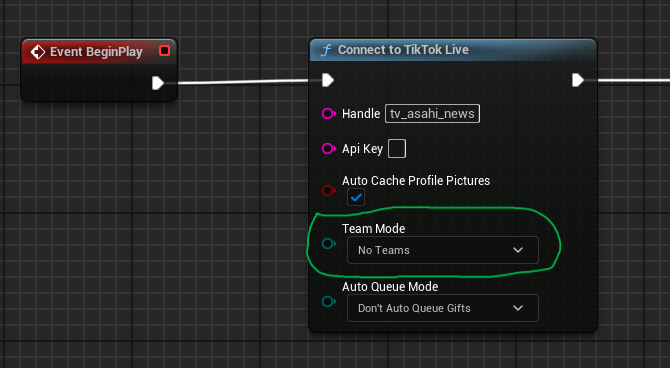

-   `Get User Team` and `Set User Team` -- These functions simply allow you to get the current team of a User or to set their team. Maybe you need to check a user's team before spawning a mob. Maybe you need to set a users team manually. 
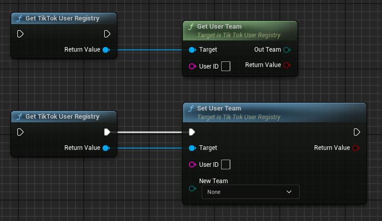

-   `Get Join Team Strings` and `Set Join Team Strings` -- Use **Get** to return the current string keys needed to join each team. The default keys are "1", "2", "3", "4". If you would like to change these join strings into something else, just use **Set** to change them. Maybe you don't want numbers and you want colors. 
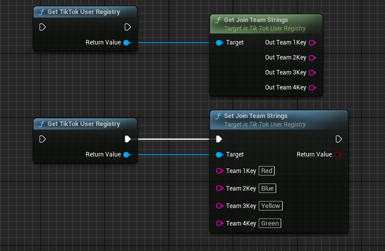

-   `Get Team Mode` and `Set Team Mode` -- Use **Get** to return what team mode you are currently in. Use **Set** to change team mode during runtime. Maybe you don't want to activate teams until you have 100+ viewers. RoomInfo --> Compare viewers --> Set Team Mode
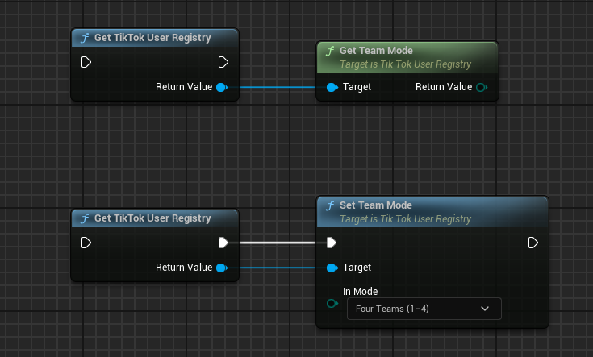

-   `Get Team Auto Reset on Change` and `Set Team Auto Reset on Change` -- There is a functionality to automatically reset a users likes and gifts whenever they change teams. Use **Get** to return the current policy for resetting likes or gifts. Use **Set** to change this auto-reset policy. 
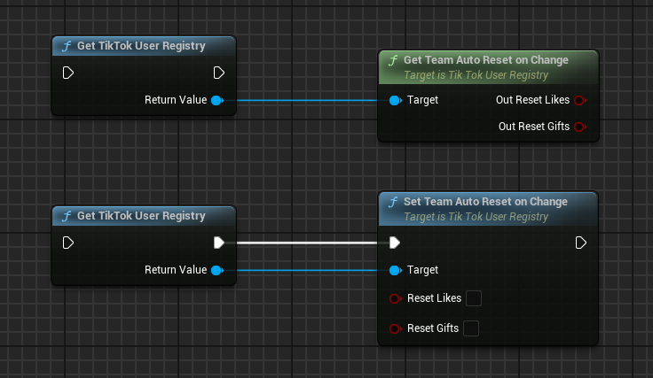

-   `Get Team Top Gifts` -- Use this node to return an array of the top [n] gifters for any specific team. This could be useful for updating leaderboards. 
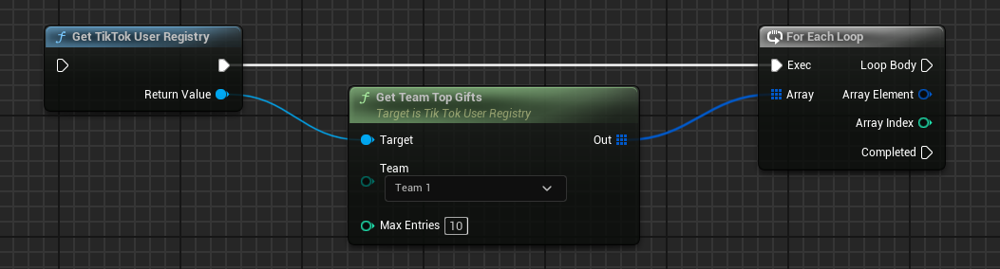

-   `Get Team Top Likes` -- Use this node to return an array of the top [n] users with the most likes for any specific team. This could be useful for updating leaderboards. 
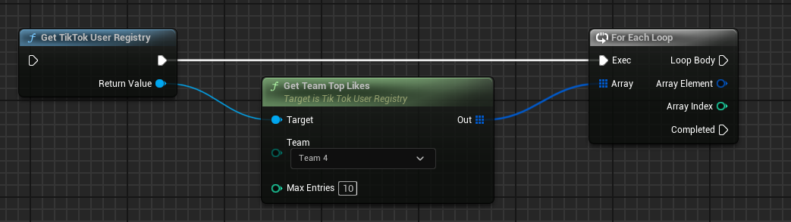

-   `Get Team Total Gifts` -- What's the point of teams without having a total score for each? Use this node to get the total Diamond/Coins for each team. 
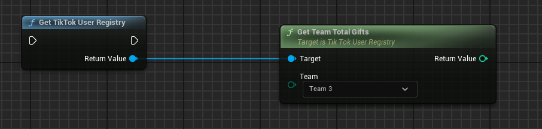 

-   `Get Team Total Likes` -- Same as the node for gifts. Use this node to get the total likes for each team. 
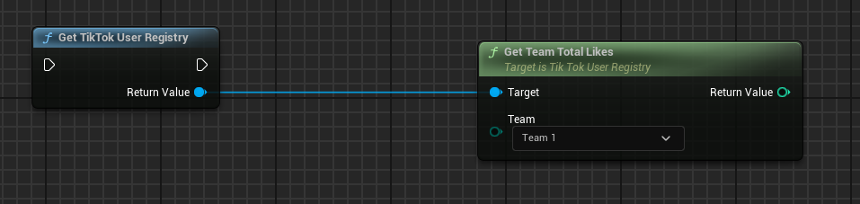 
---
## Leaderboards
-   The TikTok User Registry will automatically track and update leaderboards internally. If there is [No Teams] selected, then it will just be the global leaderboard being updated. If there are multiple teams being selected, then both the global leaderboard, and each individual team leaderboard will be tracked and updated. These leaderboards will be very useful when creating widgets to display the top users in the livestream. I recommend polling the top leaders periodically, then updating widgets if anything has changed. There are also event delegates that will fire whenever leaderboards change.

-   `Bind Event to On Leaderboard Changed` -- Bind an event to this if there are **No Teams**. This node will fire whenever the leaderboard changes. Use this to quickly updated widgets every time there is a change. Use this node with the `Get Team Top Gifts/Likes` nodes. See example below.
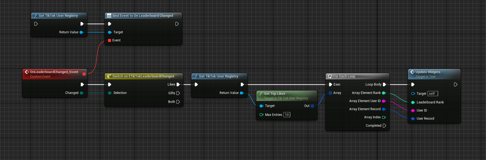

-   `Bind Event to On Team Leaderboard Changed` -- Similar to the normal leaderboard. When team mode is active, user data will be tracked on team leaderboards. Binding to this will return the top 10 users for both gifts and likes by default. If you want more control over the number, then use `Get Team Top Gifts/Likes` like in the previous example. This event will fire every time a team leaderboard changes. The node outputs a value for "Team", use this to select what widgets get updated for which team. 
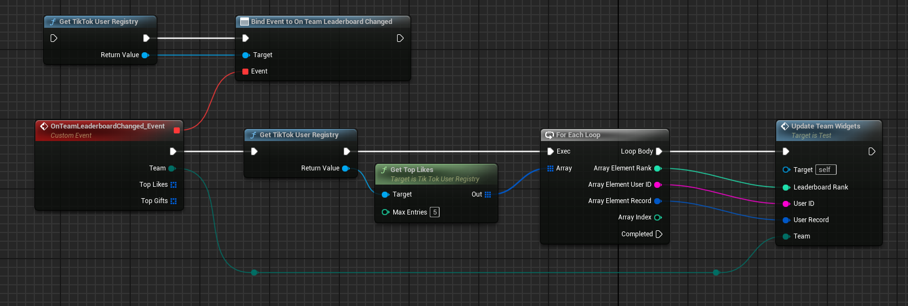

-   `Clear Gifts` and `Clear Likes` and `Clear Users` -- These 3 nodes will clear all data across the entire registry and leaderboards. Clearing gifts will remove all diamond/coin totals from each user's record, as well as set gift leaderboards to zero. Clearing likes will do the same. Clearing users will completely reset the user registry by removing all user records and resetting all leaderboards. This will also remove all cached images that were stored in each users record. 
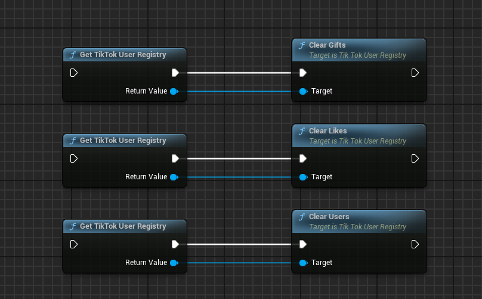

# 4. TikTok Gift Queues
The plugin comes with built in Gift Queues. Building these queues inside the editor can be very tiresome, and usually results and a spaghetti mess of blueprint nodes wired all over the place. NOT ANY MORE! All the hard work is already done. Gifts can automatically queue into their desired queues, or you can manually add and remove gifts from queues however you want. When first connecting with `Connect to TikTok Live` click the dropdown menu and select one of three options. 
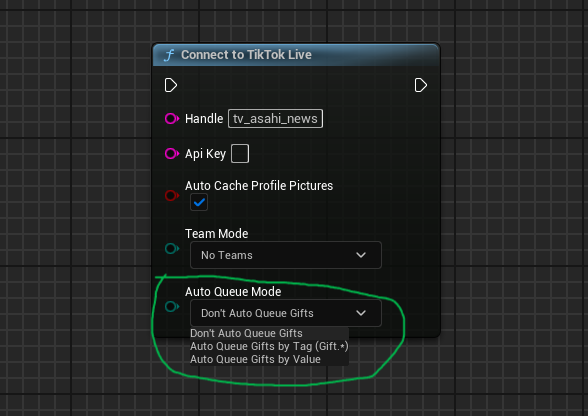 
-   `Don't Auto Queue Gifts` -- No gifts will queue automatically. You can still queue gifts, you will just have to do this manually. Maybe choose this if you want a lot of creative control over what gifts get queues under certain conditions.
-   `Auto Queue Gifts by Tag` -- Gifts will automatically queue into their proper queues by their gift name or "Tag". Depending on what team mode is active, gifts can be sorted into ("No Team" or "Team 1-4"). Each unique gift tag and team combination will output a reference to that specific unique gift queue. If you want to get the gift queue for the "Rose" gift, simply select the "Gift.rose" tag. Team 1's rose queue and Team 2's rose queue are completely different and don't affect each other. 
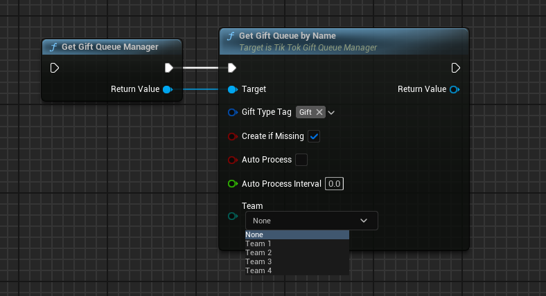 
    *   `Gift Type Tag` -- Select which gift queue you are accessing. (Gift name)
    *   `Create if Missing` -- If selected, it will create the gift queue if it doesn't exist yet.
    *   `Auto Process` -- If selected, gift queues will auto process gifts inside the queue at the selected time interval. 
    -       Example: Your character performs an 8 second animation every time someone gifts a "doughnut". Select auto process and set the Process Interval to 8.05 seconds. The gift queue will automatically process the gifts (while queue isn't empty) and perform the animation at the proper time interval.
    *   `Auto Process Interval` -- This is the interval at which the gifts will process automatically if Auto Process is selected.
      
-   `Auto Queue Gifts by Value` -- Gifts will automatically queue into their proper queues based on how many diamonds/coins they are worth. Team mode still applies if active. There are almost 300 unique gift tags built into this plugin. Maybe you don't feel like building game logic for every single 1 coin gift. In that case, just group every single 1 coin gift into a single queue, every 2-5 coin gift into a single queue, every 6-10 coin gift into a single queue... You get the idea. Each gift queue will output the gift struct when it is processed anyways, so you can still do unique things for each gift type, and user Record associated with that gift. 
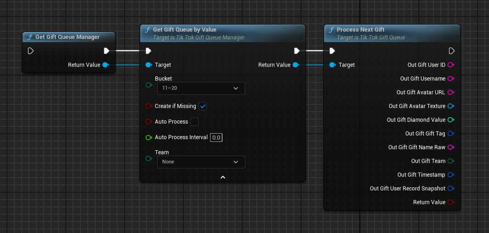
    *   `Bucket` -- Select which value range you are selecting, each range will output the unique queue for that value by team. (Gift Value)
    *   `Create if Missing` -- If selected, it will create the gift queue if it doesn't exist yet.
    *   `Auto Process` -- If selected, gift queues will auto process gifts inside the queue at the selected time interval. 
    -       Example: Your character performs an 8 second animation every time someone gifts a 20 coin gift. Select auto process and set the Process Interval to 8.05 seconds. The gift queue will automatically process the gifts (while queue isn't empty) and perform the animation at the proper time interval.
    *   `Auto Process Interval` -- This is the interval at which the gifts will process automatically if Auto Process is selected.

---
## Gift Queue Manager Functions

-   `Get Auto Queue Mode` and `Set Auto Queue Mode` -- Use **Get** to get the current auto queue mode. Use **Set** to change the current auto queue mode during runtime.
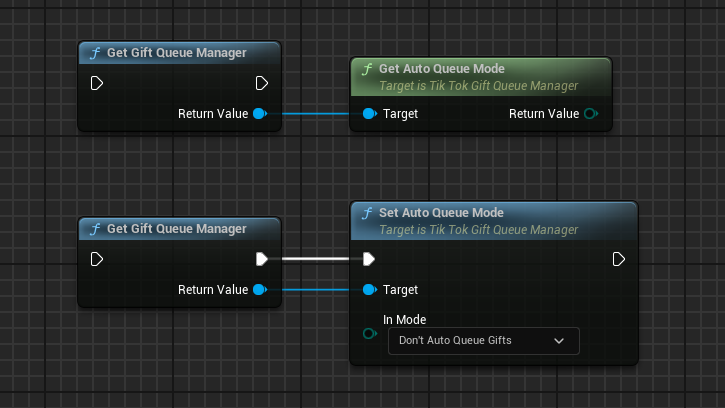

-   `Get Non Empty Queues` -- Use this node to quickly access all non-empty gift queues for a specific team. This can be useful for debugging or sifting through all queues to store a particular value. Maybe sort through all the gifts, find the highest value gift that was sent the earliest, then process that gift. Plenty of ways to utilize this node, especially if you are manually processing gifts and not using auto-process.
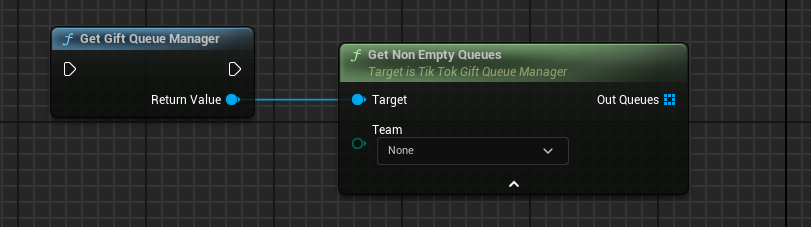

-   `Empty All Gift Queues` -- Use this node to completely empty all gift queues for all teams. Probably for a **Game Over** state, one team wins and another loses -- wipe the gift queues and reset the game. Useful for starting the game loop with fresh gift queues.
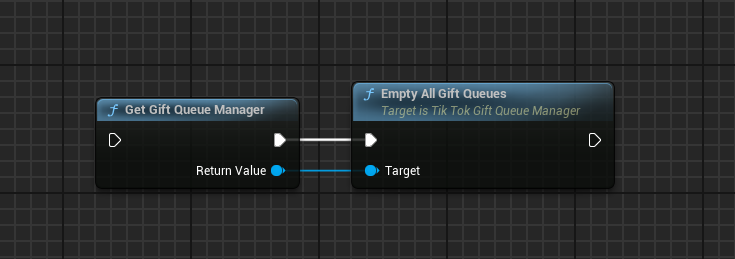

-   `Map Value to Bucket` -- This node is useful if you are manually adding/processing gifts and you want to utilize the built in value buckets. Take any gift, pass its **Diamond Value** into the node, and it will return the Enum value for the corresponding value bucket. Use this to `Get Gift Queue by Value` then add the gift or do whatever else you want to do. 
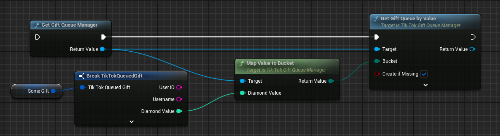

---

## Gift Queue Bindings
This is one of the most useful functionalities of the gift queues. Delegates. Bind events to specific gift queue states -- these events will fire off automatically whenever that state is achieved. Each unique queue for each of the 5 teams will have its own bindings. "Team None" rose queue bindings don't effect "Team 1" rose queue bindings, etc. These bindings open up limitless possibilities for custom game loops. Make stuff happen every time a queue becomes empty, or spawn a mob evertime a gift is processed. Use your imagination.

-   `Bind Event to On Became Non Empty` -- Bind an event to this, that event will fire off every time the target queue goes from **Empty --> Non Empty**.
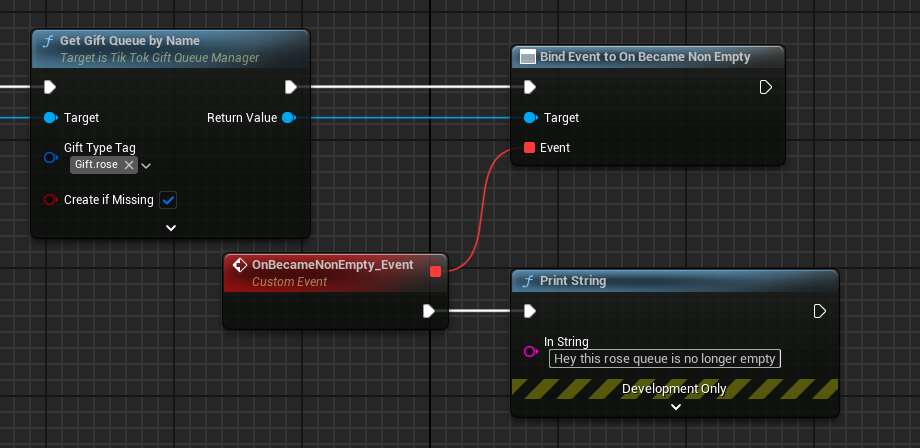

-   `Bind Event to On Gift Enqueued` -- Bind an event to this, that event will fire off every time the target queue has a gift added to it. The event outputs the gift struct of whatever gift was added to the queue, including all gift data and user data for that gift. 
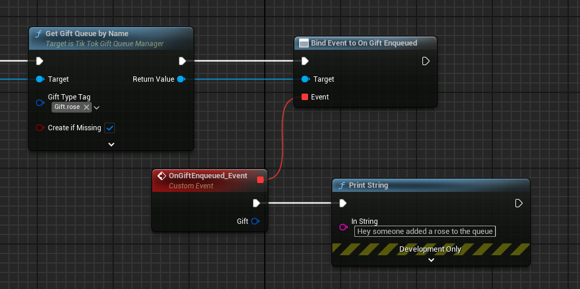

-   `Bind Event to On Gift Processed` -- Bind an event to this, that event will fire off every time the target queue processes the next gift in the queue. The event outputs the gift struct of whatever gift was processed from the queue, including all gift data and user data for that gift. 
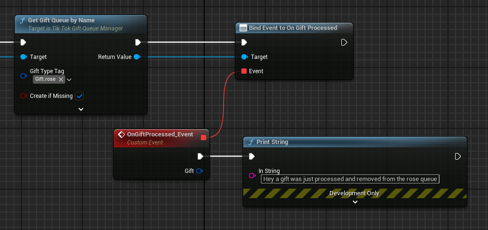

-   `Bind Event to On Became Empty` -- Bind an event to this, that event will fire off every time the target queue goes from **Non Empty --> Empty**.
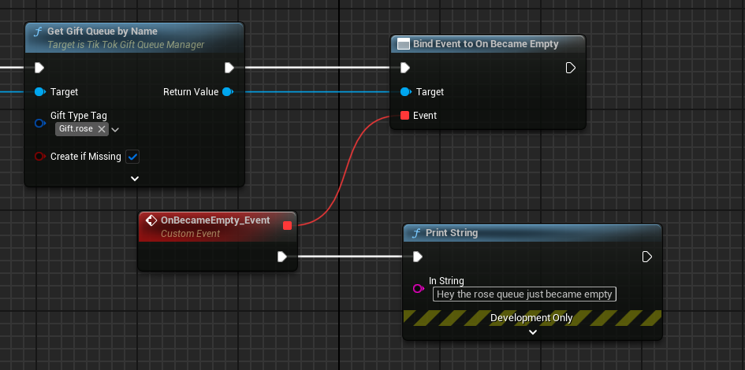

---

## Gift Queue Functions
Each unique gift queue will have functions available to it. Manage auto-processing, check how many gifts are in queue, peek next gift, process gifts, add gifts, clear queue, etc.

-   `Is Auto Processing` and `Set Auto Processing` -- Use the first node to check whether auto-processing is active or not. Use **Set** to Enable/Disable auto-processing and set the time interval.
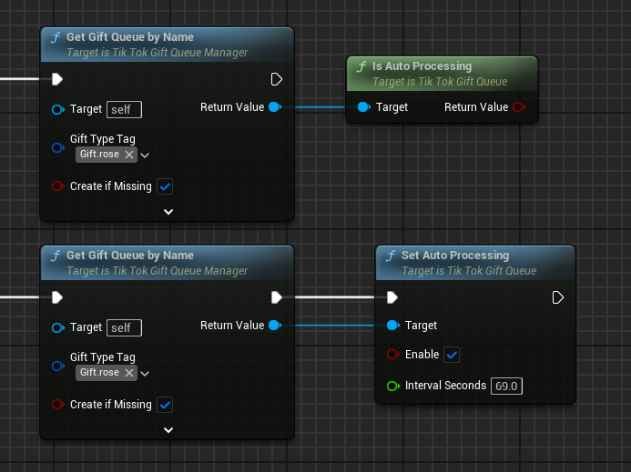

-   `Add Gift` -- Use this node to add a gift to any queue. This is especially useful for debugging. Create fake gifts and add them to queues to test everything out (Thats what I did). Also, if you do not have auto-queue active, you can use this node to manually add gifts to queues whenever they come in through `Bind On Gift Event`.
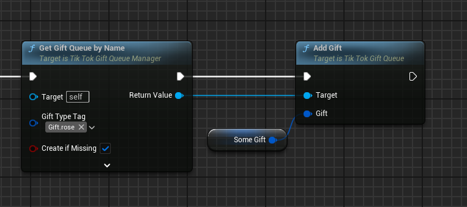

-   `Process Next Gift` -- Use this node to manually process the next gift from any queue. This is very useful if you are not using auto-processing and you want to customize when certain queues process gifts. 
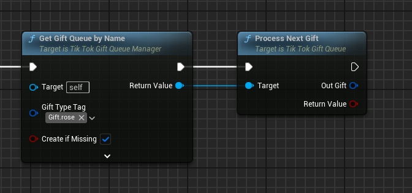

-   `Clear` -- Use this node to completely clear gifts from the target gift queue. Pretty straight forward. This will fire off `On Became Empty` if the event is bound.
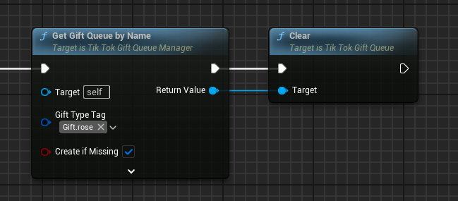

-   `Is Empty` -- This node returns a bool that is **true** if the target queue is empty and **false** if the target queue is non-empty.
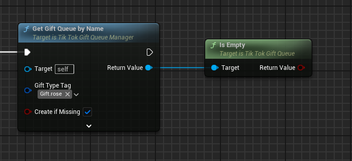

-   `Num Pending` -- This node returns an int for how many gifts remain in the target gift queue. 
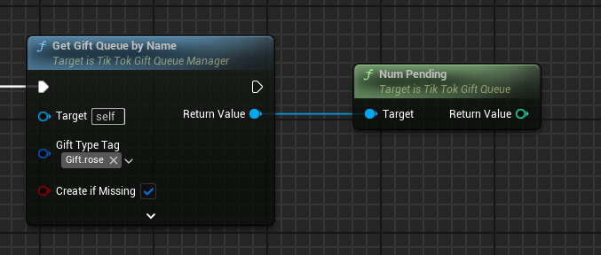

-   `Peek Next Gift` -- This node returns **false** if the target queue is empty. This node returns the next gift in the target queue, including all gift data and user record.
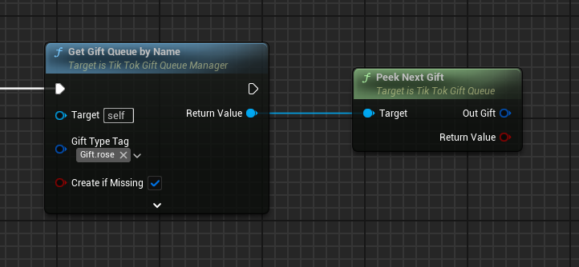

-   `Get Gift Tag` and `Get Gift Tag String` -- use these nodes to get the corresponding gift tag of the target queue, or the string value for the tag. This is useful if you are manually adding/processing gifts. Each gift struct includes both a gift tag and a gift string. You can store gift queues as variables. You can even store them into your own array of gift queue objects. Use any gift queue reference with these nodes to find out what gift tag they have.
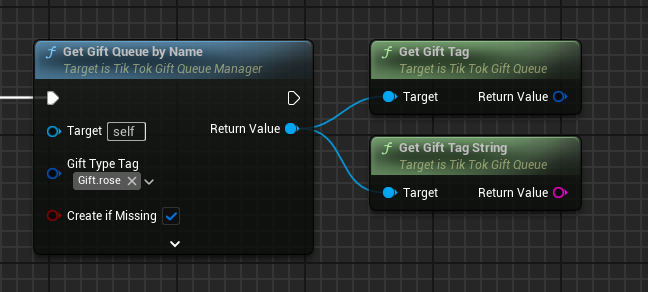 

-   `Get Gift Value Bucket` -- use this node to get the corresponding gift value bucket of the target queue. This is useful if you are manually adding/processing gifts. Each gift struct includes a diamond value, which can be passed into `Map Value to Bucket` to return the proper gift value bucket for that gift. You can store gift queues as variables. You can even store them into your own array of gift queue objects. Use any gift queue reference with this node to find out what gift value bucket is for that target queue.
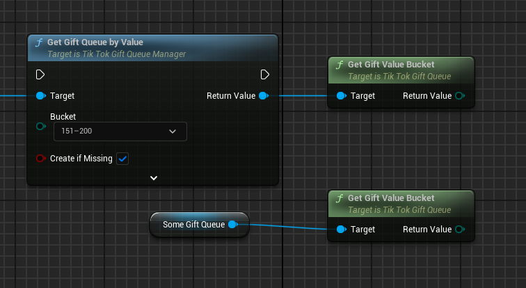 

## Gift Queue Examples
Here are some examples for some common blueprints that may seem a bit complex at first.

### Manually adding a gift to queue by name
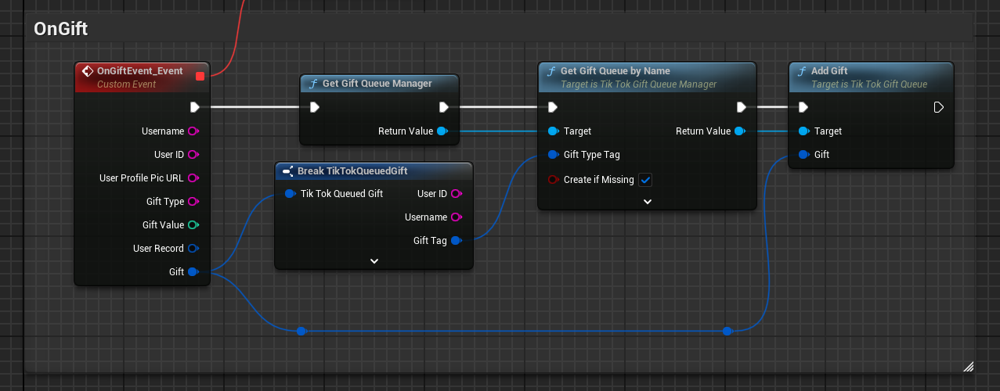 

### Manually adding a gift to queue by value
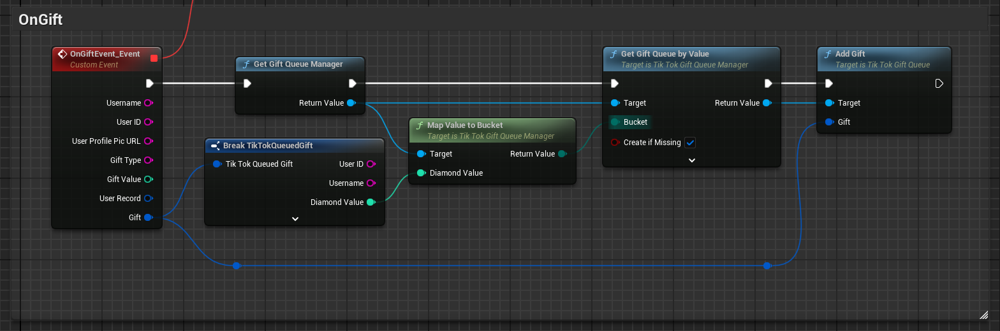 

---

## 5. Closing

Thats pretty much it. I will be making some YouTube tutorials soon, follow my channel [here](https://www.youtube.com/@RealShibaGames).

If you have any questions or need any help, join the [Discord](https://discord.com/invite/e2XwPNTBBr) and post your question in the **unreal** section. I'm pretty active there.

# Don't forget to favorite the github! ⭐

---

